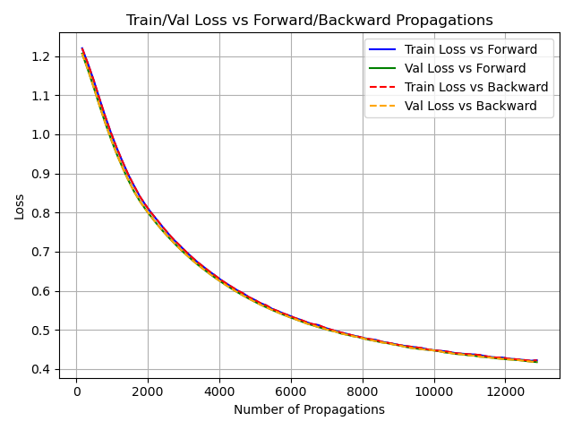
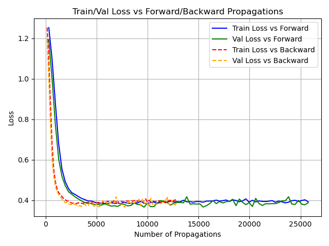
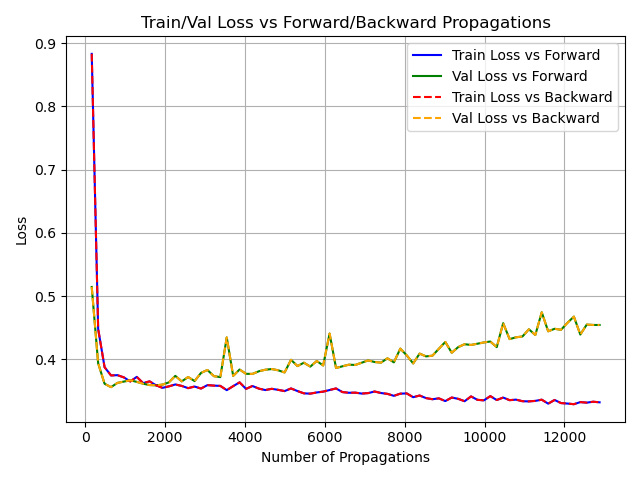

# MLB All-Star Predictor with TRNCG Optimization
This is a PyTorch based machine learning project that focuses on implementing the **Trust Region Newton Conjugate Gradient (TRNCG)** optimization algorithm to train a neural network. Since TRNCG is not available in PyTorch by default this was manually implemented. 

The network is trained to predict MLB All-Star selections using a custom-built dataset of historical player statistics. The project emphasizes hands-on implementation of numerical optimization techniques, comparative evaulation against standard optimizers like SGD and Adam, and practical machine learning workflow such as data scraping, preprocessing, model development, and result analysis.

---

## Key Features

- Custom implementation of the TRNCG optimizer using matrix-free Hessian-vector products
- Custom dataset built by combining API-based scraping and public databases, resulting in 11,465 player-season records from 2008–2023
- Exploratory data analysis using heatmaps, random forest feature importance, and PCA to guide feature selection and gain insights
- Binary classification using a neural network trained with `BCEWithLogitsLoss`
- Analyzed optimizer efficiency by tracking forward and backward propagations to reach target loss, and visualized computational cost across optimization methods
- Comparative evaluation against PyTorch's built-in SGD and Adam optimizers

---

## Trust Region Newton Conjugate Gradient
TRNCG is a second-order optimization algorithm that utilizes information about a function's Hessian in order naviagte toward a minimum, unlike first-order methods such as SGD or Adam which rely solely on gradients. 

Although explicit computation and storage of the Hessian can be computationally expensive, TRNCG only requires the Hessian-vector product $v^TB(x)$, not the full matrix. By leveraging matrix-free automatic differentiation, this project efficiently approximates that product, which allows for this second-order optimization to have reduced computational complexity and memory requirements.

---

## Results Summary

The plots below show training and validation loss as a function of the number of forward and backward propagations for each optimizer over 80 epochs. This provides a measure of computational cost, since each call to the model, especially backward propagations, is computationally expensive.

- To achieve a loss of 0.4, SGD requires the highest number of forward and backward propagations (more than 13,000 each, totaling over 26,000 propagations), making it the most computationally demanding
- TRNCG reaches the same loss using approximately 3,500 forward propagations and 1,750 backward propagations in just 10 epochs. It performs significantly better than SGD and shows resistance to overfitting, with training and validation loss remaining stable in later epochs
- Adam achieves the same loss in only about 700 total propagations over 3 epochs, making it the most efficient in terms of convergence. However, additional training results in overfitting, as seen by divergence between training and validation loss

Note: The reported propagation counts reflect training batches only. Including validation steps would approximately double the total number of propagations for each optimizer.

  <figure style="display: inline-block; margin: 10px; text-align: center;">
    
    <figcaption><strong>SGD</strong></figcaption>
  </figure>
  <figure style="display: inline-block; margin: 10px; text-align: center;">
    
    <figcaption><strong>TRNCG</strong></figcaption>
  </figure>

  <figure style="display: inline-block; margin: 10px; text-align: center;">
    
    <figcaption><strong>Adam</strong></figcaption>
  </figure>

## Conclusion
The focus of this project was to implement the Trust Region Newton Conjugate Gradient (TRNCG) optimization algorithm from scratch and compare its performance against standard optimizers available in PyTorch. TRNCG demonstrated strong computational efficiency, achieving competitive loss values with significantly fewer forward and backward propagations than SGD, and showing greater resistance to overfitting. Adam performed the best in terms of raw convergence speed and computational efficiency, requiring the fewest propagations overall. However, it was less resistant to overfitting compared to TRNCG, especially in extended training. 

